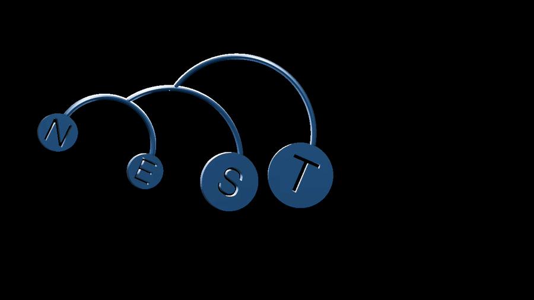

# mbl



Generate printable hanging mobiles with letters and shapes.

```bash
uv sync
uv run mbl "HELLO"
```

Shape modes:

```bash
# Built-in shape, normalized to 25 mm diameter at shape-scale 1.0
uv run mbl "LOVE" --shape heart

# Seven hearts for mom
uv run mbl "❤️❤️❤️❤️❤️❤️❤️"

# MOM stencil-cut into hearts
uv run mbl "MOM" --shape heart

# Emoji are mapped to built-in shapes automatically
uv run mbl "⭐❤️😊🐙☀️"

# Custom SVG, normalized to 25 mm diameter at shape-scale 1.0
uv run mbl "HELLO" --shape custom-shape.svg

# Use whitespace if no text is needed
uv run mbl "     " --shape shopify

# Scale shape and font (relative to the scaled shape)
uv run mbl "HELLO" --shape custom-shape.svg --shape-scale 1.5 --text-scale 0.8

# Print a stage timing profile
uv run mbl "HELLO" --shape custom-shape.svg --profile
```

Key flags:
- `--shape`: `circle` (default), `burst`, `star`, `heart`, `shopify`, `peace`, `cup`, `eclipse`, `octopus`, `smile`, `sun`, `blank`, or path to `.svg`
- `--shape-scale`: background shape multiplier (default `1.0`)
- `--text-scale`: text multiplier (default `0.8`)
- `--leaf-mass-scale`: solver calibration for leaf mass (`1.0` same, `<1` lighter, `>1` heavier)
- `--font-size`: base font size in mm
- `--output`: `.3mf` (default) or `.stl`

## SDK (golden path)

```python
from mbl import Mobile

Mobile.from_word("HELLO").to_file("hello.3mf")
Mobile.from_word("HELLO", shape="burst").to_file("hello-burst.3mf")
Mobile.from_word("MOM", shape="heart").to_file("mom.3mf")
Mobile.from_word("❤️❤️❤️❤️❤️❤️❤️").to_file("mom-7-hearts.3mf")
Mobile.from_word("⭐❤️😊🐙☀️").to_file("emoji-mix.3mf")
Mobile.from_word("HELLO", shape="custom-shape.svg", shape_scale=1.5, text_scale=0.8).to_file("hello-scaled.3mf")
Mobile.from_word("HELLO", shape="blank").to_file("hello-blank.3mf")  # Print letters as solids in Helvetica
```

## SDK (custom DSL, mixed shapes)

```python
from mbl import Arc, Mobile, Text, Circle, Burst

mobile = Mobile(
    [
        Arc(88, 12)
        @ (
            ~Text("S") & Circle(),
            ~Text("U") & Burst(),
        ),
    ]
)

mobile.to_file("sun-mixed-shapes.3mf")
```

Two-row variant:

```python
from mbl import Arc, Mobile, Text, Circle, Burst, Heart

mobile = Mobile(
    [
        Arc(88, 12) @ (~Text("S") & Circle(), None),
        Arc(64, 9)
        @ (
            ~Text("U") & Burst(),
            ~Text("N") & Heart(),
        ),
    ]
)

mobile.to_file("sun-two-row.3mf")
```

The `stencil_cut()` helper is still available as an alternative:

```python
from mbl import Arc, Leaf, Mobile, stencil_cut

mobile = Mobile([Arc(88, 12) @ (stencil_cut("S", base=Leaf.circle()), stencil_cut("U", base=Leaf.burst()))])
mobile.to_file("sun-mixed-shapes.3mf")
```

## Shape semantics

- Default shape is `circle`.
- `shape_scale=1.0` means shape diameter is normalized to `25 mm`.
- Built-ins (`circle`, `burst`, `star`, `heart`, `shopify`, `peace`, `cup`, `eclipse`, `octopus`, `smile`, `sun`) are normalized the same way.
- Custom SVGs are loaded and normalized to `25 mm` diameter before `shape_scale` is applied.
- Text subtraction/geometry uses `text_scale` independently of `shape_scale`.
- Simulation runs after shape/text scaling, so balancing uses final scaled geometry.

## Creative Commons attribution

The following built-in shapes are sourced from [Noun Project](https://thenounproject.com/) under Creative Commons:

| Shape | Author | Noun Project ID |
|-------|--------|-----------------|
| cup | Adrien Coquet | 7683336 |
| eclipse | Amazona Adorada | 7666379 |
| octopus | Moreno | 8216521 |
| smile | Dwi ridwanto | 7786982 |
| sun | Creative Stall | 130085 |
